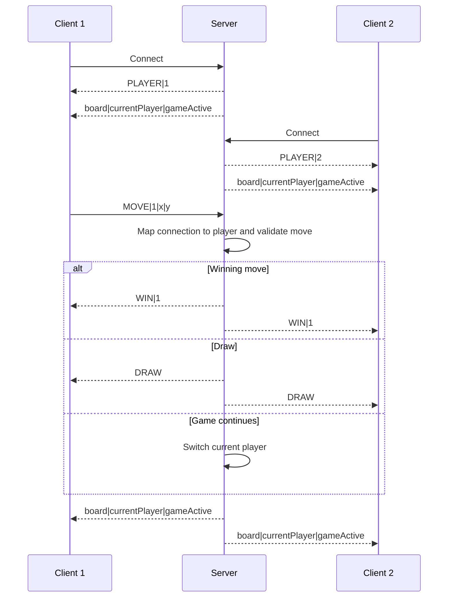

# Realtime Tic-Tac-Toe Client

Unity UI client for a two-player, server-authoritative tic-tac-toe prototype. The client requests moves and renders player assignment, board, and turn state. It briefly displays a received win or draw result, but the server's immediately following final state message replaces that text with `Game Over!`.

**Paired repository:** [Realtime Tic-Tac-Toe Server](https://github.com/PapiChulllo/realtime-tictactoe-server)

## Stack

- Unity `2022.3.46f1`
- Unity Transport `2.4.0`
- UDP port `9001`
- Default server address: `127.0.0.1`
- Unity project: `TicTacToeClient/`
- Scene: `TicTacToeClient/Assets/Scenes/SampleScene.unity`

## Editor-only run order

The server and client Build Settings scene lists are empty. These steps are therefore Editor-only; no standalone build is verified.

1. Open the paired server's `TicTacToeServer/` directory with Unity `2022.3.46f1`, open `Assets/Scenes/SampleScene.unity`, and enter Play mode first.
2. Open this repository's `TicTacToeClient/` directory as a separate Unity project with the same Editor version.
3. Open `Assets/Scenes/SampleScene.unity` and enter Play mode to connect Player 1.
4. To connect Player 2, open a second local checkout/copy of `TicTacToeClient/` in another Unity Editor, then open the same scene and enter Play mode.
5. Click a grid cell only when the status shows that it is that client's turn.

For a server on another LAN host, change the `IPAddress` constant in `TicTacToeClient/Assets/_Scripts/NetworkClient.cs` from `127.0.0.1` to that host's IPv4 address. Keep port `9001` aligned and permit UDP traffic through the host firewall.

## Server-authoritative flow

The client blocks obvious out-of-turn or post-game clicks, but the server is authoritative: it maps the sender to Player 1 or 2, validates the turn and target cell, updates the board, checks win/draw conditions, and broadcasts the result.

## Message protocol

All messages use `Encoding.Unicode`, an `int` byte-length prefix, and the reliable sequenced transport pipeline (`FragmentationPipelineStage` plus `ReliableSequencedPipelineStage`).

| Direction | Payload | Client behavior |
| --- | --- | --- |
| Server → client | `PLAYER|<1-or-2>` | Stores the assigned player number. |
| Server → client | `<r0>;<r1>;<r2>|<currentPlayer>|<gameActive>` | Renders three semicolon-separated rows containing three comma-separated cells each, then updates turn/status UI. |
| Client → server | `MOVE|<player>|<x>|<y>` | Requests a move for the clicked `Button_<x>_<y>`. |
| Server → clients | `WIN|<player>` | Briefly displays the winner and stops client-side move requests; the following final state message replaces the text with `Game Over!`. |
| Server → clients | `DRAW` | Briefly displays a draw and stops client-side move requests; the following final state message replaces the text with `Game Over!`. |

Both sides create a fragmentation-only fire-and-forget pipeline as well, but the game does not use it.

## Player cap, disconnects, and rematches

The server admits only its first two connections. It does not reclaim a player number after disconnect, so reconnecting cannot replace a departed player without restarting the server. The client has no reconnect flow.

There is no networked rematch. `ResetGame` only clears this client's local UI and flags; it sends no reset request and cannot change the server's board. Restart the server and both clients for a fresh authoritative match.

## Repository map

- `TicTacToeClient/Assets/_Scripts/NetworkClient.cs` — connection lifecycle, protocol parsing, grid wiring, move requests, and UI updates.
- `TicTacToeClient/Assets/Scenes/SampleScene.unity` — configured 3×3 button grid and status text.
- `TicTacToeClient/Packages/manifest.json` — package versions.
- `TicTacToeClient/ProjectSettings/` — Unity project configuration; its build-scene list is empty.

## Limitations

- Two clients are required for normal turn progression, with no bot, spectator, or local pass-and-play mode.
- Disconnects are terminal for the match's fixed player slots; there is no reconnect or state-recovery flow.
- There is no authoritative rematch command; the public client reset method is local-only.
- Win/draw result text is transient: the server sends `WIN` or `DRAW` and then the final board state, whose UI update overwrites the result with `Game Over!`.
- There is no production authentication, authorization, TLS/encryption, matchmaking, lobby, persistence, rate limiting, or malformed-message hardening.
- There are no automated tests. Unity compilation, Play mode, and builds were not verified in this documentation pass because Unity was unavailable.

See the [Realtime Tic-Tac-Toe Server](https://github.com/PapiChulllo/realtime-tictactoe-server) for authoritative rules, player assignment, and result broadcasting.
